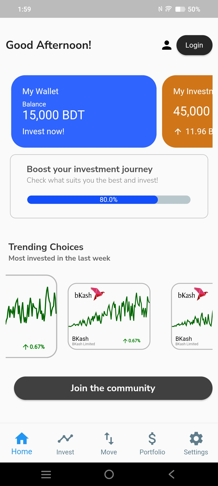
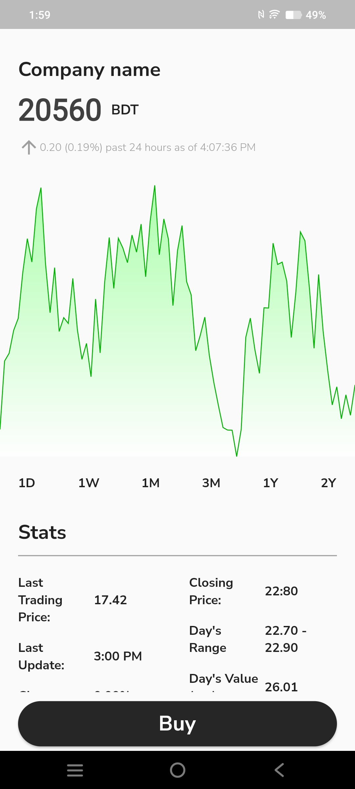
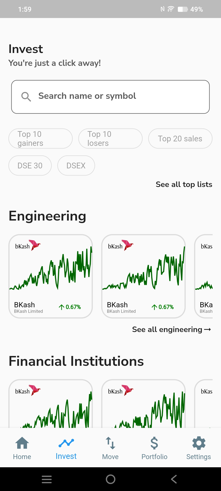
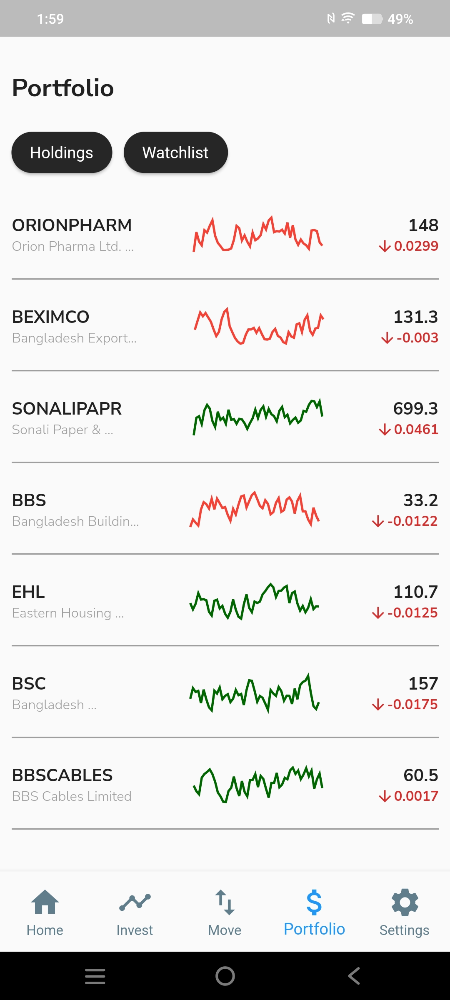

# Mudra

Mudra is a Flutter mobile app prototype for personal investing and portfolio tracking. It brings together a wallet-style home screen, market discovery, buy/sell flows, portfolio holdings, watchlists, fund movement, profile settings, and transaction history in one mobile experience.

> This project is a UI/prototype app with local sample data. It is not connected to live brokerage, banking, or market-data services.

## Demo

<p>
  
  
  
  
</p>

## Features

- Bottom-tab navigation for Home, Invest, Move, Portfolio, and Settings
- Wallet and investment balance cards on the home screen
- Market discovery screen with search, gainers/losers filters, company cards, and chart previews
- Company detail pages with line charts, stats, buy-share, and alert flows
- Portfolio holdings and watchlist screens powered by local JSON records
- Add/withdraw fund entry points
- Profile, account settings, identity information, and transaction history screens
- Custom Nunito font styling and Flutter Material UI components

## Tech Stack

- Flutter
- Dart
- `fl_chart` for chart rendering
- `percent_indicator` for progress-style UI
- Local JSON fixtures for sample portfolio, watchlist, and transaction records
- Android and iOS project scaffolding

## Project Structure

```text
.
├── android/                 # Android platform project
├── docs/screenshots/        # README/demo screenshots
├── ios/                     # iOS platform project
├── lib/
│   ├── Common/              # Shared chart and separator widgets
│   ├── Data/                # Local portfolio and watchlist JSON data
│   ├── images/              # Runtime app image assets
│   ├── screens/             # App screens and feature flows
│   └── styles/              # Shared text and button styles
├── test/                    # Flutter widget tests
├── pubspec.yaml
└── README.md
```

## Getting Started

Make sure Flutter is installed and available on your path.

```bash
flutter --version
flutter pub get
flutter run
```

To run the test suite:

```bash
flutter test
```

## Notes

- The app currently uses local fixture data from `lib/Data/` and `lib/screens/transaction_history/data.json`.
- Documentation screenshots live in `docs/screenshots/` so they are separate from runtime app assets.
- The Flutter app now lives at the repository root, so GitHub visitors can see the codebase immediately without opening a nested project folder.
